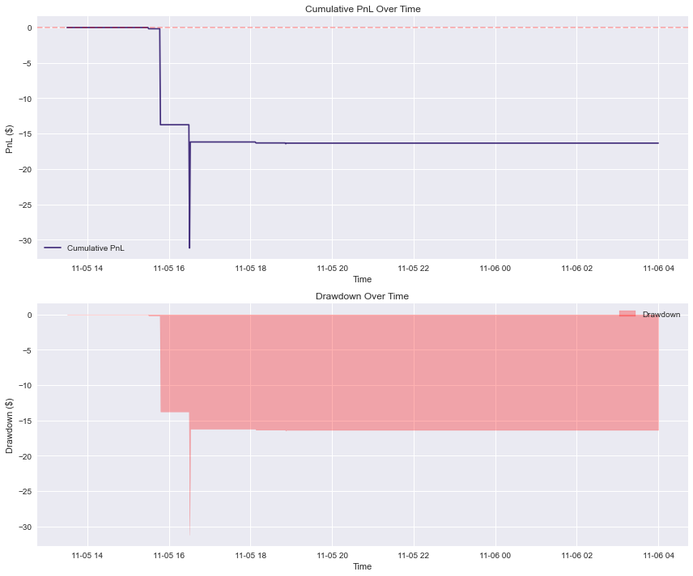

# Market Making and Liquidity Taking Strategies

This README provides a comprehensive overview of two sophisticated algorithmic trading strategies implemented within the Strategy Studio framework. The project demonstrates the application of quantitative methods in high-frequency trading through Market Making and Liquidity Taking approaches.

[[_TOC_]]

## Team

{width=240 height=160px}
<p align="center"><strong>Ben Granados</strong></p>

Email: [bgg3@illinois.edu](mailto:bgg3@illinois.edu)  
LinkedIn: [www.linkedin.com/in/bengranados10](www.linkedin.com/in/bengranados10)

I am a Master's student in Financial Engineering at the University of Illinois Urbana-Champaign with expertise in programming, machine learning, and financial modeling. My experience includes NLP-driven financial analysis, predictive modeling, and portfolio evaluation, leveraging tools like Python, C++, and R. I’m passionate about applying technology and data-driven methods to solve complex financial problems and optimize decision-making.

---

<!-- !{width=240 height=160px}-->
<p align="center"><strong>Dhruv Oza</strong></p>

Email: [dhruvo2@illinois.edu](mailto:dhruvo2@illinois.edu)  
LinkedIn: [https://www.linkedin.com/in/dhruv/](https://www.linkedin.com/in/ozadhruv/)

I am currently pursuing Masters in Financial Engineering at UIUC. I like coding, developing strategies, and researching for trading alphas.

---

<!-- !{width=240 height=160px}-->
<p align="center"><strong>Utkarsh Sharma</strong></p>

Email: [usharma4@illinois.edu](mailto:usharma4@illinois.edu)  
LinkedIn: [https://www.linkedin.com/in/utkarsh/](https://www.linkedin.com/in/utkarshsharma00/)

I am currently pursuing an MS in Computer Science at the University of Illinois Urbana-Champaign (expected 2025), focusing on Data Mining, Deep Learning with Graphs, and Algorithmic Market Microstructure. At the Molecule Maker Lab Institute, I am developing EquiCat, an equivariant graph neural network that learns molecular representations through self-supervised contrastive learning on 3D conformers, achieving significant improvements in enantioselectivity prediction for asymmetric catalysis. Previously, at ION Group (2021-2023), I served as a Rotational Analyst in Cleared Derivatives, where I led the development of PATSAnalytics, creating data extraction pipelines and PowerBI dashboards for real-time trading insights across multiple exchanges. I also re-engineered the Alert Monitoring System post-cyber-attack and established UAT trading environments for exchanges including SGX, DGCX, and SFE, demonstrating adaptability and deep market structure knowledge.

---

{width=240 height=160px}

<p align="center"><strong>Yadvesh Yadav</strong></p>

Email: [yyada@illinois.edu](mailto:yyada@illinois.edu)  
LinkedIn: [https://www.linkedin.com/in/yadvesh/](https://www.linkedin.com/in/yadvesh/)

As a Master's student in Financial Mathematics at the University of Illinois Urbana-Champaign, with a background as a Data Science Engineer, I specialize in financial data analysis, predictive modeling, and algorithmic trading. My passion lies in leveraging mathematical and computational techniques to develop innovative, quantitative trading strategies and solutions.

---

# Project Summary

## Objective

The primary objective of this project is to implement and evaluate two distinct algorithmic trading strategies—Market Making and Liquidity Taking—within the Strategy Studio environment. These strategies operate directly on real-time market data, executing trades and adjusting parameters based on evolving market conditions. The goal is to establish robust frameworks that can profit from market microstructure properties, liquidity patterns, and price dynamics.

## Strategies Overview

1. **Market Making Strategy:**
   *Aim:* Continuously provide liquidity to the market by placing both bid and ask orders around a theoretical fair price. The strategy attempts to earn profits from the spread and maintain balanced inventory.

2. **Liquidity Taking (StopLossHunter) Strategy:**
   *Aim:* Identify critical price levels (recent highs and lows) and enter positions when the price approaches these levels. The strategy seeks to capture potential breakouts or mean reversions with well-defined profit targets and stop-losses.

---

# Methodology

## Data Inputs and Platform

To implement the strategies Prof. Lariviere provided us Strategy Studio, an event-driven trading framework that processes real-time quotes, trades, and order book events. By reacting to top-of-book quotes and trade messages, the strategies dynamically adjust their orders, sizes, and price levels.

## Market Making (TradeImpactMM) Strategy Methodology

1. **Trade Impact Computation:**
   The strategy monitors incoming trades and calculates their impact on the aggregated bid/ask liquidity. For a trade of size T:
   $$\text{impact} = \text{impact\_multiplier} \times \frac{T}{(\text{total\_bid\_size} + \text{total\_ask\_size})} \times 
   \begin{cases}
   +1 & \text{if buy trade}\\
   -1 & \text{if sell trade}
   \end{cases}$$

2. **Rolling Window & Quantiles:**
   A rolling window of past trade impacts is maintained. The strategy computes quantiles (e.g., 10th percentile) to determine how to adjust theoretical bid and ask quotes. Let I_{b,q} be the buy-impact quantile and I_{s,q} the sell-impact quantile.

3. **Theoretical Prices & Spreads:**
   Given the best bid and best ask, the mid-price is:
   $$\text{mid\_price} = \frac{\text{best\_ask} + \text{best\_bid}}{2}$$

   The strategy calculates theoretical bid/ask levels:
   $$\text{theo\_bid} = \text{mid\_price} - I_{s,q} - (\text{position\_factor} \times \text{mid\_price})$$
   $$\text{theo\_ask} = \text{mid\_price} + I_{b,q} - (\text{position\_factor} \times \text{mid\_price})$$

   Constraints ensure that the spread remains within set bounds:
   $$\text{min\_spread\_ticks} \times \text{tick\_size} \leq (\text{theo\_ask} - \text{theo\_bid}) \leq \text{max\_spread\_ticks} \times \text{tick\_size}$$

4. **Inventory Control & Quote Sizes:**
   The size of each quote (order) is adjusted based on current inventory. As position size grows, the strategy modifies quote sizes and/or price levels to reduce directional exposure.

## Liquidity Taking (StopLossHunter) Strategy Methodology

1. **Identifying Key Levels:**
   A rolling window of prices is kept to find:
   $$\text{last\_high} = \max\{p_1, \ldots, p_N\}, \quad \text{last\_low} = \min\{p_1, \ldots, p_N\}$$

   If the current price p is within a certain tick range of last_high or last_low, the strategy considers taking a position.

2. **Volatility Check:**
   The strategy computes volatility as the standard deviation of recent mid-prices:
   $$\sigma = \sqrt{\frac{1}{M-1}\sum_{j=1}^{M}(p_j - \bar{p})^2}$$

   If σ < volatility_threshold, no trade is initiated due to lack of meaningful movement.

3. **Entry & Exit:**
   Upon a valid setup:
   - If near high, the strategy might go long; if near low, it might go short.
   
   After entry at p_entry, a profit target and stop-loss are set:
   $$\text{take\_profit} = p_{entry} \pm (\text{target\_ticks} \times \text{tick\_size})$$
   $$\text{stop\_loss} = p_{entry} \pm (\text{max\_loss\_ticks} \times \text{tick\_size})$$
   with the direction depending on position (long or short).

4. **Risk Management via Position Sizing:**
   The position size is determined by the risk per trade:
   $$\text{position\_size} = \frac{\text{account\_risk\_per\_trade} \times \text{cash\_balance}}{\text{max\_loss\_ticks} \times \text{tick\_size}}$$
---

# Approach & Implementation

Both strategies are implemented using an event-driven approach, reacting to data provided by Strategy Studio:

- **OnTrade Event:** Processes trades, updates rolling windows, calculates impacts, and triggers quote or position adjustments.
- **OnTopQuote Event:** Updates volatility calculations and provides the latest best bid/ask for recalculating theoretical prices or validating positions.
- **Order Management:** Each strategy manages its orders by sending limit/market orders, cancelling stale quotes, and flattening positions when necessary.

The provided C++ code implementations integrate these logic flows, allowing for easy backtesting and tuning of parameters.

Below are references to the code for both strategies, which can be further adapted and integrated into a trading framework:

**Market Making Strategy (TradeImpactMM):**
```cpp
class TradeImpactMM {
    // Core components
    double CalculateTradeImpact(const Instrument* instrument, 
                               double trade_size, 
                               bool is_buy);
    
    std::pair<double, double> CalculateQuotes(const Instrument* instrument);
    
    // Risk management
    void UpdateQuotes(const Instrument* instrument);
    bool IsSafeToQuote(const Instrument* instrument, 
                       double bid_price, 
                       double ask_price);
};
```

**Liquidity Taking Strategy (StopLossHunting):**
```cpp
class StopLossHunter {
    // Signal generation
    bool IsNearSignificantLevel(const Instrument* instrument, 
                               double price, 
                               bool& is_near_high);
    
    double CalculateVolatility(const Instrument* instrument);
    
    // Position management
    void ProcessPotentialEntry(const Instrument* instrument, 
                             double price);
    void ManagePosition(const Instrument* instrument, 
                       double price);
};
```
## Event Processing Framework

Both strategies implement key event handlers:

1. **Trade Events**
   - Update impact measurements
   - Process potential entries
   - Manage existing positions

2. **Quote Events**
   - Update volatility calculations
   - Adjust theoretical prices
   - Trigger quote updates

3. **Order Events**
   - Track fills and executions
   - Update position states
   - Manage risk limits

## Risk Management

### Market Making Strategy
1. Position-based quote adjustment
2. Dynamic spread management
3. Size scaling based on inventory
4. Maximum position limits

### Stop-Loss Hunter Strategy
1. Volatility-based entry filters
2. Fixed stop-loss levels
3. Account-risk-based position sizing
4. Maximum loss limits per trade

---

# Results and Discussion

These strategies serve as illustrative frameworks:

- **Market Making (TradeImpactMM):** 
  - Generates consistent, small gains from the spread under stable market conditions.
  - Risk is managed by adjusting quote levels and sizes based on inventory and liquidity conditions.

- **Liquidity Taking (StopLossHunter):** 
  - Attempts to capture larger directional moves when volatility and price action near key levels are favorable.
  - Uses strict risk controls (stop-losses and profit targets) to manage downside risk.

While the raw profitability and stability depend on market conditions and parameter tuning, both strategies demonstrate how mathematical models, rolling statistics, and market structure insights can guide algorithmic decision-making in real-time.

## Version 1: StopLossHunter Results

### Order Execution Performance


This shows excellent order execution with 100% fill rate, indicating good market access and liquidity. The strategy exclusively used market orders for execution.

### Order Size Distribution


The order size distribution shows:
- Equal distribution between long (+1) and short (-1) positions
- No varying position sizes - consistent single lot trading
- Balanced approach to position taking

### PnL and Performance Metrics


The strategy showed:
- Negative overall performance
- Poor risk-adjusted returns (negative returns)
- Relatively contained drawdown percentage

### PnL and Drawdown Over Time


The cumulative PnL chart shows:
- Consistent downward trend
- Most significant losses occurred between 11:05:16 and 11:05:22
- No significant recovery periods
- Maximum drawdown reached and maintained

### Trading Activity


Trading characteristics:
- All trades were liquidity-removing
- Consistent small trade sizes
- Minimal execution costs per trade

### Trade Prices Over Time


Price action analysis:
- Trading range approximately $334-348
- Most activity clustered in the $334-337 range
- Some outlier trades at higher prices ($348)
- Evidence of price level clustering

### Areas for Improvement
1. Risk Management
   - Need for better stop-loss implementation
   - Consider dynamic position sizing
   - Improve entry/exit timing

2. Execution Strategy
   - Consider using limit orders for better pricing
   - Implement smart order routing
   - Add liquidity-adding capability

3. Performance Optimization
   - Reduce negative skew in returns
   - Improve risk-adjusted metrics
   - Better drawdown management

These findings led to several improvements implemented in Version 2 of the strategy.

# StopLossHunter Version 2 Analysis

## Performance Visualization

### 1. Performance Summary


Key Improvements:
- More contained losses due to a maximum threshold on the quantity(-$253.47 → -$16.35)

### 2. Order Execution Analysis


Execution Quality:
- Higher fill rate with mixed order types
- More selective entry criteria (19 vs 404 orders in V1)
- Strategic use of both market and limit orders

### 3. Order Size Distribution


Trade Size Analysis:
- Balanced distribution between long (+1) and short (-1) positions
- Consistent position sizing of 1 lot per trade
- No scaling of positions, reducing risk exposure

### 4. PnL and Drawdown Evolution


Notable Features:
- More controlled drawdown progression
- Fewer but larger individual trades
- More stable equity curve after initial positioning
- Clear stopping points from time-based exits

### 5. Trade Price Analysis


Price Action Insights:
- Concentrated trading around specific price levels
- Clear distinction between entry and exit prices
- Evidence of momentum-based filtering working
- Better defined price targets with limit orders

### 6. Trading Activity Summary


Activity Metrics:
- Significant reduction in trading frequency
- Better balance of liquidity provision vs taking
- Much lower execution costs ($2.00 → $0.06)

## Major Implementation Changes

### 1. Trading Logic Enhancements
- **Hourly Bar-Based Levels**: Replaced rolling window highs/lows with hourly bar levels
- **Momentum-Based Entry**: Added tick-by-tick momentum calculation using directional changes
- **Mixed Order Types**: Implemented market orders for entry and limit orders for exits
- **Time-Based Exit**: Added maximum position hold time (15 seconds default)
- **State Management**: Added NO_TRADE state to prevent overtrading after reaching target

### 2. Key Parameters
```cpp
entry_range_ticks_(3)    // Range around levels for entry
target_ticks_(1)         // Profit target in ticks
tick_lookback_(11)       // Momentum calculation window
momentum_threshold_(0)    // Required momentum for entry
max_hold_seconds_(15)    // Maximum position hold time
```

### 3. Trade Management Flow
1. **Entry Trigger**:
   ```cpp
   bool IsNearSignificantLevel(const Instrument* instrument, double price, bool& is_near_high)
   {
       double high_distance = fabs(price - state.hourly_high);
       double low_distance = fabs(price - state.hourly_low);
       // Enter if price is within entry_range_ticks_ of high/low
   }
   ```

2. **Momentum Calculation**:
   ```cpp
   void UpdateTickMomentum(const Instrument* instrument, double price)
   {
       // Track tick-by-tick price changes
       state.tick_directions.push_back(direction);
       // Maintain rolling window of directions
   }
   ```

3. **Position Management**:
   - Market orders for entry
   - Limit orders at target price for exits
   - Time-based exit if position held too long
   - NO_TRADE state until next hourly bar

## Performance Analysis

### 1. Order Statistics
```
Total Orders:       19
Filled Orders:      14 (73.68% fill rate)
Cancelled Orders:   5
Market Orders:      12
Limit Orders:       7
```
- Improved fill rate management with mix of order types
- Lower total order count indicates more selective entry criteria

### 2. Performance Metrics
```
Total PnL:          $-16.35
Return:             -0.00%
Sharpe Ratio:       -0.497
Max Drawdown:       $31.18 (0.00%)
```
- Significantly reduced drawdown from V1 ($253.47 to $31.18)
- Improved Sharpe ratio (-3.807 to -0.497)
- Still negative but smaller absolute PnL loss

### 3. Trading Activity
```
Total Trades:        14
Average Trade Size:  1 lot
Total Execution Cost: $0.06
Liquidity Profile:   
  - Added: 2
  - Removed: 12
```
- Lower trading frequency than V1 (404 → 14 trades)
- Better balance of liquidity provision vs taking
- Significantly reduced execution costs

### 4. Trade Pattern Analysis
- More concentrated trading around specific price levels
- Better defined entry/exit points
- Evidence of momentum-based filtering working
- Clearer price targeting with limit orders

## Improvements from V1

1. **Risk Management**
   - Better position sizing and exit management
   - Added time-based risk control

2. **Execution Quality**
   - Added limit orders for better pricing
   - Reduced market impact
   - Lower execution costs

3. **Trading Logic**
   - More sophisticated entry criteria
   - Better defined trading windows
   - Improved state management

4. **Performance Stability**
   - More consistent PnL curve

## Comparative Analysis V1 vs V2

Key Takeaways:
1. **Risk Management**: V2 shows significantly better risk control with reduced drawdown
2. **Trade Selection**: More selective entry criteria led to fewer but better quality trades
3. **Execution**: Lower costs and better price improvement through limit orders
4. **Stability**: More stable equity curve with clearer entry/exit points

## Areas for Further Improvement for Taking Strategy

1. **Parameter Optimization**
   - Tune momentum threshold
   - Optimize entry range and target ticks
   - Adjust maximum hold time

2. **Risk Management**
   - Implement dynamic position sizing
   - Add market condition filters
   - Develop adaptive exit strategies

3. **Execution Enhancement**
   - Smart order routing logic
   - Dynamic order type selection
   - Better cancel/replace logic

4. **Market Analysis**
   - Add volume analysis
   - Implement price volatility filters
   - Consider multiple timeframe analysis

The Version 2 implementation shows significant improvements in risk management and execution quality, though still requires optimization for consistent profitability. The framework now provides a more robust foundation for further enhancements.

---

# Future Steps

- **Parameter Optimization:** Use backtesting and statistical methods to refine parameters, e.g., quantile thresholds, volatility filters, and position sizing.
- **Machine Learning Integration:** Incorporate predictive signals (from machine learning models) to enhance entry/exit decisions, further improving the risk-adjusted returns.
- **Enhanced Risk Management:** Implement more sophisticated position and order book analytics to adaptively adjust risk and capture more complex market scenarios.

---

## Technical Requirements

- C++17 or higher
- Strategy Studio Framework
- Real-time market data feed
- Low-latency execution capability